# Práctica 3 - Desarrollo guiado por pruebas

Nombre del alumno: Beniamin Scrobota Campean

### Ejemplo 1

**INPUT y OUTPUT**: "1" -> 1

**EJ1. Código de test**
```java
@Test
void parseSingleDigitNumber() {
    assertEquals(1, calculatorParser.parse("1"));
}
```

**EJ1. Mensaje del test añadido que NO PASA**

```log
java.lang.UnsupportedOperationException: Not implemented yet
```

**EJ1. Código mínimo para que el test pase**

Describe brevemente el código mínimo implementado

```java
public int parse(String expression) {
    return 1;
}
```

**EJ1. Captura de que TODOS los test PASAN**

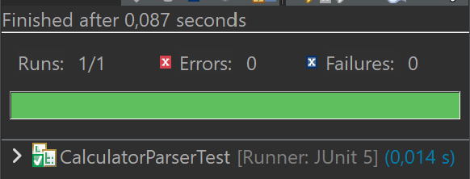

### Ejemplo 2

**INPUT y OUTPUT**: "2" -> 2

**EJ2. Código de test**
```java
@Test
void parseSingleDigitNumber2() {
    assertEquals(2, calculatorParser.parse("2"));
}
```

**EJ2. Mensaje del test añadido que NO PASA**

```log
org.opentest4j.AssertionFailedError: expected: <2> but was: <1>
```

**EJ2. Código mínimo para que el test pase**

Describe brevemente el código mínimo implementado

```java
public int parse(String expression) {
    if (expression.equals("1")) {
        return 1;
    }
    return 2;
}
```

**EJ2. Captura de que TODOS los test PASAN**

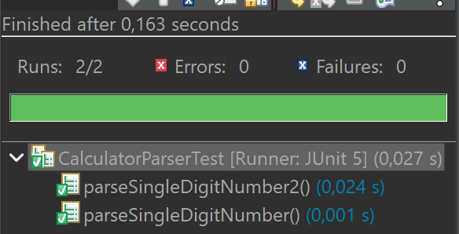

### Ejemplo 3

**INPUT y OUTPUT**: "3" -> 3

**EJ3. Código de test**
```java
@Test
void parseSingleDigitNumber2() {
    assertEquals(3, calculatorParser.parse("3"));
}
```

**EJ3. Mensaje del test añadido que NO PASA**

```log
org.opentest4j.AssertionFailedError: expected: <3> but was: <2>
```

**EJ3. Código mínimo para que el test pase**

Describe brevemente el código mínimo implementado

```java
public int parse(String expression) {
	if (expression.equals("1")) {
		return 1;
	}
	if (expression.equals("2")) {
	        return 2;
	}
	return 3;
}
```

**EJ3. Captura de que TODOS los test PASAN**

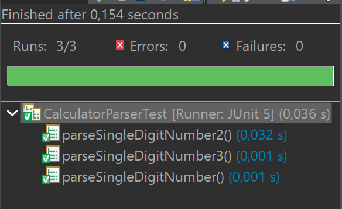

**EJ3. Refactorización**

Justificar vuestra refactorización aquí.

```java
public int parse(String expression) {
	return Integer.parseInt(expression);
}
```
**EJ3. Captura de que TODOS los tests PASAN tras la refactorización**


### Ejemplo 4

**INPUT y OUTPUT**: "1 + 1" -> 2

**EJ4. Código de test**

```java
@Test
void parseSimpleAddition1() {
    assertEquals(2, calculatorParser.parse("1 + 1"));
}
```

**EJ4. Mensaje del test añadido que NO PASA**

```log
java.lang.NumberFormatException: For input string: "1 + 1"
```

**EJ4. Código mínimo para que el test pase**

Describe brevemente el código mínimo implementado

```java
public int parse(String expression) {
	if(expression.equals("1 + 1")) {
		return 1 + 1;
	}
	return Integer.parseInt(expression);
}
```

**EJ4. Captura de que TODOS los test PASAN**

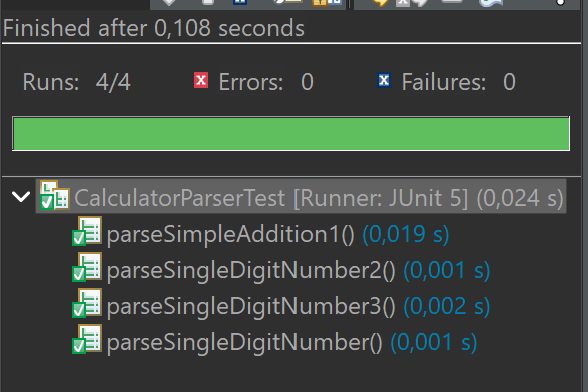

### Ejemplo 5

**INPUT y OUTPUT**: "2 + 3" -> 5

**EJ5. Código de test**

```java
@Test
void parseSimpleAddition2() {
	assertEquals(5, calculatorParser.parse("2 + 3"));
}
```

**EJ5. Mensaje del test añadido que NO PASA**

```log
java.lang.NumberFormatException: For input string: "2 + 3"
```

**EJ5. Código mínimo para que el test pase**

Describe brevemente el código mínimo implementado

```java
public int parse(String expression) {
	if(expression.equals("1 + 1")) {
		return 2;
	}
	if(expression.equals("2 + 3")) {
		return 5;
	}
	return Integer.parseInt(expression);
}
```

**EJ5. Captura de que TODOS los test PASAN**

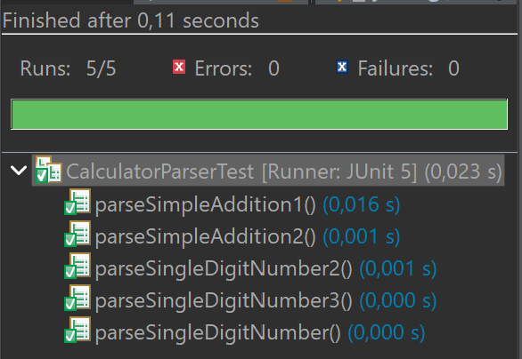

**EJ5. Refactorización**

Se va a hacer una modificación para que se acepten cualquier par de valores y se haga la suma automáticamente.

```java
public int parse(String expression) {
	if(expression.length() > 1) {
		String [] splittedExpression = expression.split(" ");
		return Integer.parseInt(splittedExpression[0]) + Integer.parseInt(splittedExpression[2]);
	}
	return Integer.parseInt(expression);
}
```
**EJ5. Captura de que TODOS los tests PASAN tras la refactorización**

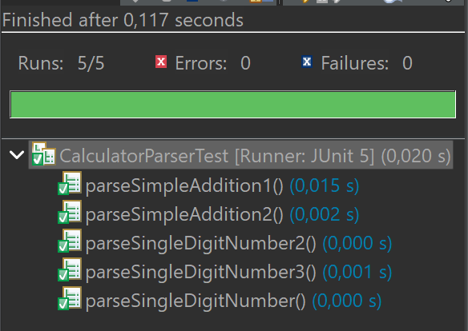

### Ejemplo 6

**INPUT y OUTPUT**: "2 + 3 + 4" -> 9

**EJ6. Código de test**

```java
@Test
void parseSimpleAdditionThreeElements() {
	assertEquals(9, calculatorParser.parse("2 + 3 + 4"));
}
```

**EJ6. Mensaje del test añadido que NO PASA**

```log
org.opentest4j.AssertionFailedError: expected: <9> but was: <5>
```

**EJ6. Código mínimo para que el test pase**

Describe brevemente el código mínimo implementado

```java
public int parse(String expression) {
	if(expression.length() > 1) {
		String [] splittedExpression = expression.split(" ");
		if(splittedExpression.length == 3) {
			return Integer.parseInt(splittedExpression[0]) + Integer.parseInt(splittedExpression[2]);
		}
		return Integer.parseInt(splittedExpression[0]) + Integer.parseInt(splittedExpression[2]) + Integer.parseInt(splittedExpression[4]);
	}
	return Integer.parseInt(expression);
}
```

**EJ6. Captura de que TODOS los test PASAN**

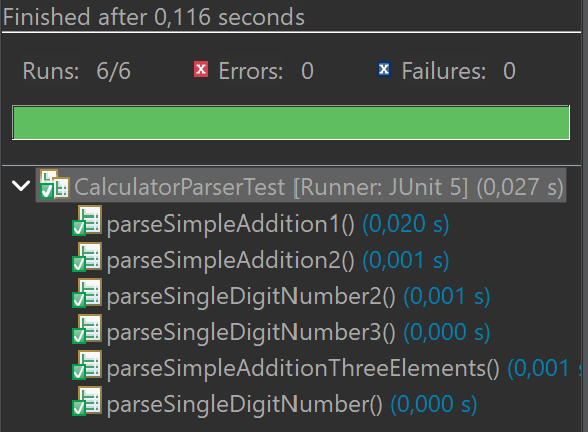

### Ejemplo 7

**INPUT y OUTPUT**: "1 + 2 + 3 + 4" -> 10

**EJ7. Código de test**

```java
@Test
void parseSimpleAdditionFourElements() {
	assertEquals(10, calculatorParser.parse("1 + 2 + 3 + 4"));
}
```

**EJ7. Mensaje del test añadido que NO PASA**

```log
org.opentest4j.AssertionFailedError: expected: <10> but was: <6>
```

**EJ7. Código mínimo para que el test pase**

Describe brevemente el código mínimo implementado

```java
public int parse(String expression) {
	if(expression.length() > 1) {
		String [] splittedExpression = expression.split(" ");
		if(splittedExpression.length == 3) {
			return Integer.parseInt(splittedExpression[0]) + Integer.parseInt(splittedExpression[2]);
		}
		if(splittedExpression.length == 5) {
			return Integer.parseInt(splittedExpression[0]) + Integer.parseInt(splittedExpression[2]) + Integer.parseInt(splittedExpression[4]);
		}
		return Integer.parseInt(splittedExpression[0]) + Integer.parseInt(splittedExpression[2]) + Integer.parseInt(splittedExpression[4]) + Integer.parseInt(splittedExpression[6]);
	}
	return Integer.parseInt(expression);
}
```

**EJ7. Captura de que TODOS los test PASAN**

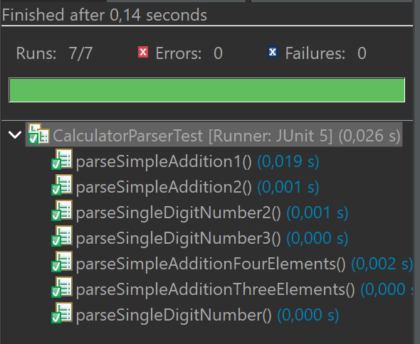

**EJ7. Refactorización**

Se va a hacer una modificación para que se acepten cualquier numero de valores y se haga la suma automáticamente.

```java
public int parse(String expression) {
	if(expression.length() > 1) {
		String [] splittedExpression = expression.split(" ");
		int result = Integer.parseInt(splittedExpression[0]);
		for (int i=0; i<splittedExpression.length-1; i++) {
			result += Integer.parseInt(splittedExpression[i+2]);
			i++;
		}
		return result;
	}
	return Integer.parseInt(expression);
}
```
**EJ7. Captura de que TODOS los tests PASAN tras la refactorización**


### Ejemplo 8

**INPUT y OUTPUT**: "A" -> Invalid expression

**EJ8. Código de test**

```java
@Test
void parseInvalidExpressionLetterA() {
	assertThrowsExactly(IllegalArgumentException.class, () -> calculatorParser.parse("A"));
}
```

**EJ8. Mensaje del test añadido que NO PASA**

```log
org.opentest4j.AssertionFailedError: Unexpected exception type thrown, expected: <java.lang.IllegalArgumentException> but was: <java.lang.NumberFormatException>
```

**EJ8. Código mínimo para que el test pase**

Describe brevemente el código mínimo implementado

```java
public int parse(String expression) {
	if(expression.equals("A")){
		throw new IllegalArgumentException("Invalid expression");
	}
	if(expression.length() > 1) {
		String [] splittedExpression = expression.split(" ");
		int result = Integer.parseInt(splittedExpression[0]);
		for (int i=0; i<splittedExpression.length-1; i++) {
			result += Integer.parseInt(splittedExpression[i+2]);
			i++;
		}
		return result;
	}
	return Integer.parseInt(expression);
}
```

**EJ8. Captura de que TODOS los test PASAN**

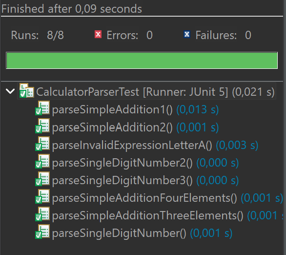

### Ejemplo 9

**INPUT y OUTPUT**: "B" -> Invalid expression

**EJ9. Código de test**

```java
@Test
void parseInvalidExpressionLetterA() {
	assertThrowsExactly(IllegalArgumentException.class, () -> calculatorParser.parse("B"));
}
```

**EJ9. Mensaje del test añadido que NO PASA**

```log
org.opentest4j.AssertionFailedError: Unexpected exception type thrown, expected: <java.lang.IllegalArgumentException> but was: <java.lang.NumberFormatException>
```

**EJ9. Código mínimo para que el test pase**

Describe brevemente el código mínimo implementado

```java
public int parse(String expression) {
	if(expression.equals("A")){
		throw new IllegalArgumentException("Invalid expression");
	}
	if(expression.equals("B")){
		throw new IllegalArgumentException("Invalid expression");
	}
	if(expression.length() > 1) {
		String [] splittedExpression = expression.split(" ");
		int result = Integer.parseInt(splittedExpression[0]);
		for (int i=0; i<splittedExpression.length-1; i++) {
			result += Integer.parseInt(splittedExpression[i+2]);
			i++;
		}
		return result;
	}
	return Integer.parseInt(expression);
}
```

**EJ9. Captura de que TODOS los test PASAN**

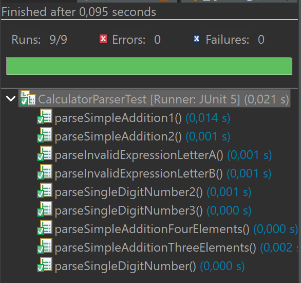

### Ejemplo 10

**INPUT y OUTPUT**: "k" -> Invalid expression

**EJ10. Código de test**

```java
@Test
void parseInvalidExpressionLetterk() {
	assertThrowsExactly(IllegalArgumentException.class, () -> calculatorParser.parse("k"));
}
```

**EJ10. Mensaje del test añadido que NO PASA**

```log
org.opentest4j.AssertionFailedError: Unexpected exception type thrown, expected: <java.lang.IllegalArgumentException> but was: <java.lang.NumberFormatException>
```

**EJ10. Código mínimo para que el test pase**

Describe brevemente el código mínimo implementado

```java
public int parse(String expression) {
	if(expression.equals("A")){
		throw new IllegalArgumentException("Invalid expression");
	}
	if(expression.equals("B")){
		throw new IllegalArgumentException("Invalid expression");
	}
	if(expression.equals("k")){
		throw new IllegalArgumentException("Invalid expression");
	}
	if(expression.length() > 1) {
		String [] splittedExpression = expression.split(" ");
		int result = Integer.parseInt(splittedExpression[0]);
		for (int i=0; i<splittedExpression.length-1; i++) {
			result += Integer.parseInt(splittedExpression[i+2]);
			i++;
		}
		return result;
	}
	return Integer.parseInt(expression);
}
```

**EJ10. Captura de que TODOS los test PASAN**

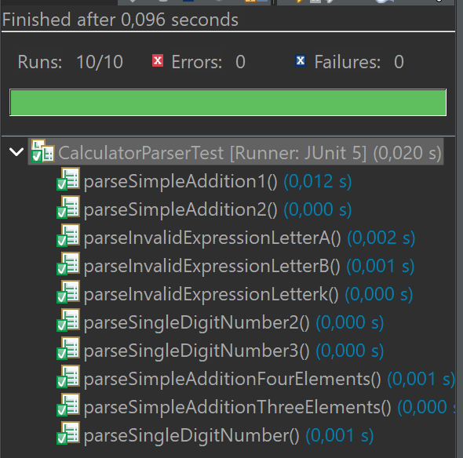

**EJ10. Refactorización**

Justificar vuestra refactorización aquí.

```java
public int parse(String expression) {
	if (expression.length() == 1 && Character.isLetter(expression.charAt(0))) {
		throw new IllegalArgumentException("Invalid expression");
	}
	if(expression.length() > 1) {
		String [] splittedExpression = expression.split(" ");
		int result = Integer.parseInt(splittedExpression[0]);
		for (int i=0; i<splittedExpression.length-1; i++) {
			result += Integer.parseInt(splittedExpression[i+2]);
			i++;
		}
		return result;
	}
	return Integer.parseInt(expression);
}
```
**EJ10. Captura de que TODOS los tests PASAN tras la refactorización**

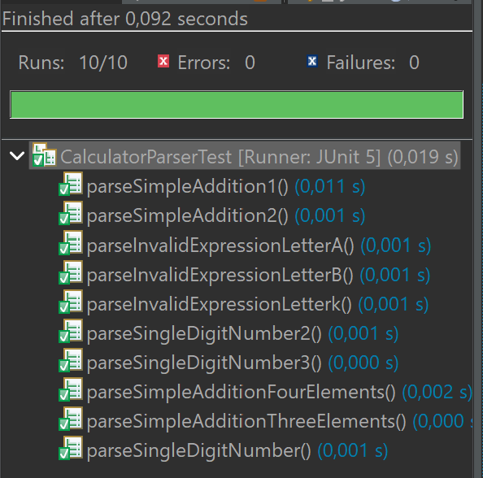

### Ejemplo 11

**INPUT y OUTPUT**: "HoLa" -> Invalid expression

**EJ11. Código de test**

```java
@Test
void parseInvalidExpressionWord() {
	assertThrowsExactly(IllegalArgumentException.class, () -> calculatorParser.parse("HoLa"));
}
```

**EJ11. Mensaje del test añadido que NO PASA**

```log
org.opentest4j.AssertionFailedError: Unexpected exception type thrown, expected: <java.lang.IllegalArgumentException> but was: <java.lang.NumberFormatException>
```

**EJ11. Código mínimo para que el test pase**

Describe brevemente el código mínimo implementado

```java
public int parse(String expression) {
	if (expression.length() == 1 && Character.isLetter(expression.charAt(0))) {
		throw new IllegalArgumentException("Invalid expression");
	}
	if(expression.equals("HoLa")) {
		throw new IllegalArgumentException("Invalid expression");
	}
	if(expression.length() > 1) {
		String [] splittedExpression = expression.split(" ");
		int result = Integer.parseInt(splittedExpression[0]);
		for (int i=0; i<splittedExpression.length-1; i++) {
			result += Integer.parseInt(splittedExpression[i+2]);
			i++;
		}
		return result;
	}
	return Integer.parseInt(expression);
}
```

**EJ11. Captura de que TODOS los test PASAN**

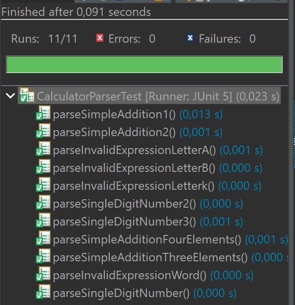

**EJ11. Refactorización**

Justificar vuestra refactorización aquí.

```java
public int parse(String expression) {
	boolean allLetters = true;
	for (int i = 0; i < expression.length(); i++) {
		if (!Character.isLetter(expression.charAt(i))) {
			allLetters = false;
			break;
		}
	}
	if (allLetters) {
		throw new IllegalArgumentException("Invalid expression");
	}
	if(expression.length() > 1) {
		String [] splittedExpression = expression.split(" ");
		int result = Integer.parseInt(splittedExpression[0]);
		for (int i=0; i<splittedExpression.length-1; i++) {
			result += Integer.parseInt(splittedExpression[i+2]);
			i++;
		}
		return result;
	}
	return Integer.parseInt(expression);
}
```
**EJ11. Captura de que TODOS los tests PASAN tras la refactorización**

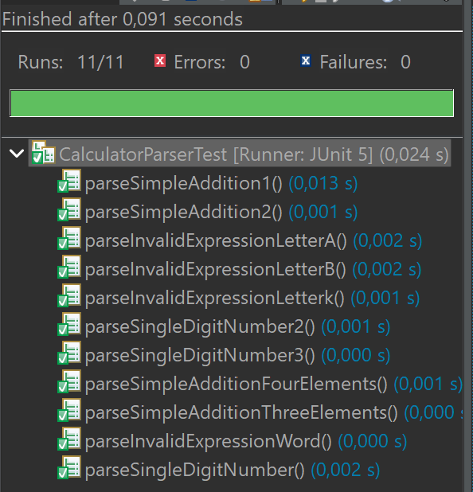

### Ejemplo 12

**INPUT y OUTPUT**: "1 + A" -> Invalid expression

**EJ12. Código de test**

```java
@Test
void parseInvalidExpressionNumberPlusLetter() {
	assertThrowsExactly(IllegalArgumentException.class, () -> calculatorParser.parse("1 + A"));
}
```

**EJ12. Mensaje del test añadido que NO PASA**

```log
org.opentest4j.AssertionFailedError: Unexpected exception type thrown, expected: <java.lang.IllegalArgumentException> but was: <java.lang.NumberFormatException>
```

**EJ12. Código mínimo para que el test pase**

Describe brevemente el código mínimo implementado

```java
public int parse(String expression) {
	boolean allLetters = true;
	for (int i = 0; i < expression.length(); i++) {
		if (!Character.isLetter(expression.charAt(i))) {
			allLetters = false;
			break;
		}
	}
	if (allLetters) {
		throw new IllegalArgumentException("Invalid expression");
	}
	if (expression.equals("1 + A")) {
	        throw new IllegalArgumentException("Invalid expression");
	}
	if(expression.length() > 1) {
		String [] splittedExpression = expression.split(" ");
		int result = Integer.parseInt(splittedExpression[0]);
		for (int i=0; i<splittedExpression.length-1; i++) {
			result += Integer.parseInt(splittedExpression[i+2]);
			i++;
		}
		return result;
	}
	return Integer.parseInt(expression);
}
```

**EJ12. Captura de que TODOS los test PASAN**

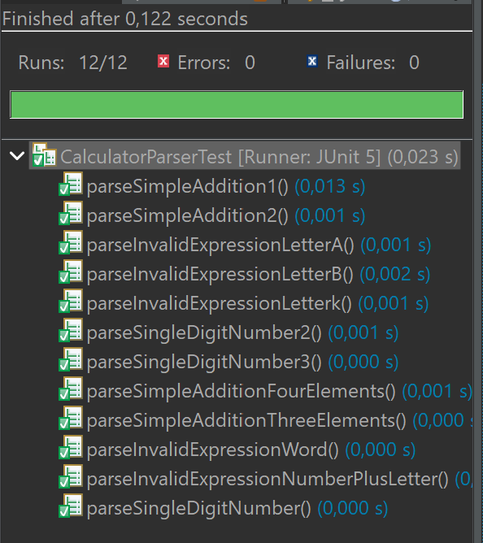

**EJ12. Refactorización**

Justificar vuestra refactorización aquí.

```java
public int parse(String expression) {
	checkIfHasLetter(expression);
	if(expression.length() > 1) {
		String [] splittedExpression = expression.split(" ");
		int result = Integer.parseInt(splittedExpression[0]);
		for (int i=0; i<splittedExpression.length-1; i++) {
			result += Integer.parseInt(splittedExpression[i+2]);
			i++;
		}
		return result;
	}
	return Integer.parseInt(expression);
}

private void checkIfHasLetter(String expression) {
	boolean thereIsLetter = false;
	for (int i = 0; i < expression.length(); i++) {
		if (Character.isLetter(expression.charAt(i))) {
			thereIsLetter = true;
			break;
	        }
	}
	if (thereIsLetter) {
		throw new IllegalArgumentException("Invalid expression");
	}
}

```
**EJ12. Captura de que TODOS los tests PASAN tras la refactorización**

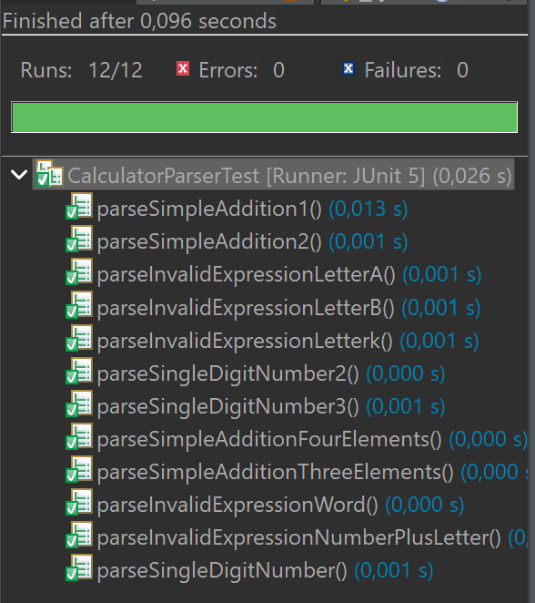

### Ejemplo 13

**INPUT y OUTPUT**: "5 - 3" -> 2

**EJ13. Código de test**

```java
@Test
void parseSimpleSubstraction1() {
	assertEquals(2, calculatorParser.parse("5 - 3"));
}
```

**EJ13. Mensaje del test añadido que NO PASA**

```log
org.opentest4j.AssertionFailedError: expected: <2> but was: <8>
```

**EJ13. Código mínimo para que el test pase**

Describe brevemente el código mínimo implementado

```java
public int parse(String expression) {
	checkIfHasLetter(expression);
	if(expression.equals("5 - 3")) {
		return 2;
	}
	if(expression.length() > 1) {
		String [] splittedExpression = expression.split(" ");
		int result = Integer.parseInt(splittedExpression[0]);
		for (int i=0; i<splittedExpression.length-1; i++) {
			result += Integer.parseInt(splittedExpression[i+2]);
			i++;
		}
		return result;
	}
	return Integer.parseInt(expression);
}
```

**EJ13. Captura de que TODOS los test PASAN**

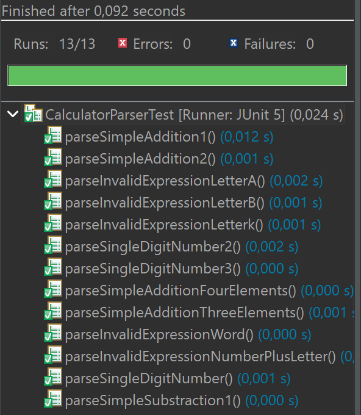

### Ejemplo 14

**INPUT y OUTPUT**: "1 - 2" -> -1

**EJ14. Código de test**

```java
@Test
void parseSimpleSubstraction2() {
	assertEquals(-1, calculatorParser.parse("1 - 2"));
}
```

**EJ14. Mensaje del test añadido que NO PASA**

```log
org.opentest4j.AssertionFailedError: expected: <-1> but was: <3>
```

**EJ14. Código mínimo para que el test pase**

Describe brevemente el código mínimo implementado

```java
public int parse(String expression) {
	checkIfHasLetter(expression);
	if(expression.equals("5 - 3")) {
		return 2;
	}
	if(expression.equals("1 - 2")) {
		return -1;
	}
	if(expression.length() > 1) {
		String [] splittedExpression = expression.split(" ");
		int result = Integer.parseInt(splittedExpression[0]);
		for (int i=0; i<splittedExpression.length-1; i++) {
			result += Integer.parseInt(splittedExpression[i+2]);
			i++;
		}
		return result;
	}
	return Integer.parseInt(expression);
}
```

**EJ14. Captura de que TODOS los test PASAN**

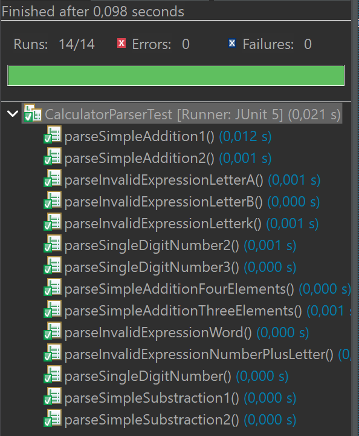

**EJ14. Refactorización**

Justificar vuestra refactorización aquí.

```java
public int parse(String expression) {
	checkIfHasLetter(expression);
	if(expression.length() > 1) {
		String [] splittedExpression = expression.split(" ");
		int result = Integer.parseInt(splittedExpression[0]);
		if(splittedExpression[1].equals("-")) {
			return Integer.parseInt(splittedExpression[0]) - Integer.parseInt(splittedExpression[2]);
		}
		for (int i=0; i<splittedExpression.length-1; i++) {
			result += Integer.parseInt(splittedExpression[i+2]);
			i++;
		}
		return result;
	}
	return Integer.parseInt(expression);
}
```
**EJ14. Captura de que TODOS los tests PASAN tras la refactorización**

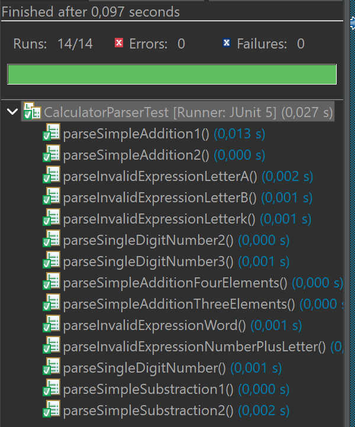

### Ejemplo 15

**INPUT y OUTPUT**: "7 - 2 - 1" -> 4

**EJ15. Código de test**

```java
@Test
void parseSimpleSubstraction3() {
	assertEquals(4, calculatorParser.parse("7 - 2 - 1"));
}
```

**EJ15. Mensaje del test añadido que NO PASA**

```log
org.opentest4j.AssertionFailedError: expected: <4> but was: <5>
```

**EJ15. Código mínimo para que el test pase**

Describe brevemente el código mínimo implementado

```java
public int parse(String expression) {
	checkIfHasLetter(expression);
	if(expression.equals("7 - 2 - 1")) {
		return 4;
	}
	if(expression.length() > 1) {
		String [] splittedExpression = expression.split(" ");
		int result = Integer.parseInt(splittedExpression[0]);
		if(splittedExpression[1].equals("-")) {
			return Integer.parseInt(splittedExpression[0]) - Integer.parseInt(splittedExpression[2]);
		}
		for (int i=0; i<splittedExpression.length-1; i++) {
			result += Integer.parseInt(splittedExpression[i+2]);
			i++;
		}
		return result;
	}
	return Integer.parseInt(expression);
}
```

**EJ15. Captura de que TODOS los test PASAN**


### Ejemplo 16

**INPUT y OUTPUT**: "9 - 5 - 3 - 1" -> 0

**EJ16. Código de test**

```java
@Test
void parseSimpleSubstraction4() {
	assertEquals(0, calculatorParser.parse("9 - 5 - 3 - 1"));
}
```

**EJ16. Mensaje del test añadido que NO PASA**

```log
org.opentest4j.AssertionFailedError: expected: <0> but was: <4>

```

**EJ16. Código mínimo para que el test pase**

Describe brevemente el código mínimo implementado

```java
public int parse(String expression) {
	checkIfHasLetter(expression);
	if(expression.equals("7 - 2 - 1")) {
		return 4;
	}
	if(expression.equals("9 - 5 - 3 - 1")) {
		return 0;
	}
	if(expression.length() > 1) {
		String [] splittedExpression = expression.split(" ");
		int result = Integer.parseInt(splittedExpression[0]);
		if(splittedExpression[1].equals("-")) {
			return Integer.parseInt(splittedExpression[0]) - Integer.parseInt(splittedExpression[2]);
		}
		for (int i=0; i<splittedExpression.length-1; i++) {
			result += Integer.parseInt(splittedExpression[i+2]);
			i++;
		}
		return result;
	}
	return Integer.parseInt(expression);
}
```

**EJ16. Captura de que TODOS los test PASAN**

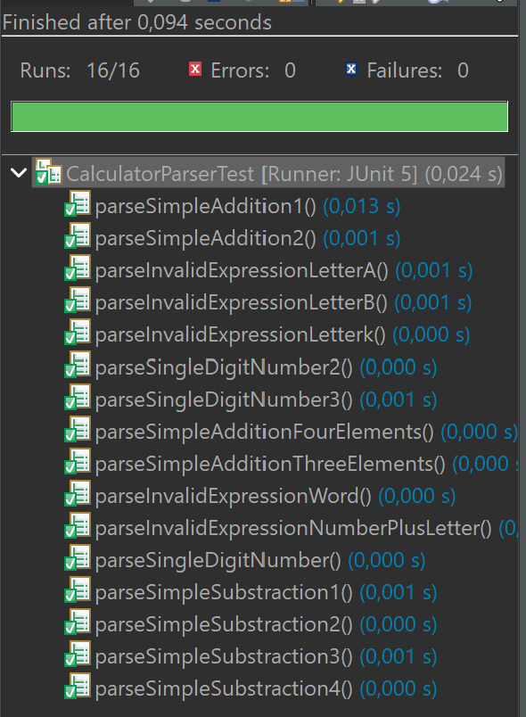

**EJ16. Refactorización**

Justificar vuestra refactorización aquí.

```java
public int parse(String expression) {
	checkIfHasLetter(expression);
	if(expression.length() > 1) {
		String [] splittedExpression = expression.split(" ");
		int result = Integer.parseInt(splittedExpression[0]);
		if(splittedExpression[1].equals("-")) {
			for (int i=0; i<splittedExpression.length-1; i++) {
				result -= Integer.parseInt(splittedExpression[i+2]);
				i++;
			}
			return result;
		}
		for (int i=0; i<splittedExpression.length-1; i++) {
			result += Integer.parseInt(splittedExpression[i+2]);
			i++;
		}
		return result;
	}
	return Integer.parseInt(expression);
}
```
**EJ16. Captura de que TODOS los tests PASAN tras la refactorización**


### Ejemplo 17

**INPUT y OUTPUT**: "7 + 1 - 5" -> 3

**EJ17. Código de test**

```java
@Test
void parseSimpleAdditionAndSubstraction1() {
	assertEquals(3, calculatorParser.parse("7 + 1  - 5"));
}
```

**EJ17. Mensaje del test añadido que NO PASA**

```log
org.opentest4j.AssertionFailedError: expected: <3> but was: <13>
```

**EJ17. Código mínimo para que el test pase**

Describe brevemente el código mínimo implementado

```java
public int parse(String expression) {
	checkIfHasLetter(expression);
	if(expression.equals("7 + 1 - 5")) {
		return 3;
	}
	if(expression.length() > 1) {
		String [] splittedExpression = expression.split(" ");
		int result = Integer.parseInt(splittedExpression[0]);
		if(splittedExpression[1].equals("-")) {
			for (int i=0; i<splittedExpression.length-1; i++) {
				result -= Integer.parseInt(splittedExpression[i+2]);
				i++;
			}
			return result;
		}
		for (int i=0; i<splittedExpression.length-1; i++) {
			result += Integer.parseInt(splittedExpression[i+2]);
			i++;
		}
		return result;
	}
	return Integer.parseInt(expression);
}
```

**EJ17. Captura de que TODOS los test PASAN**

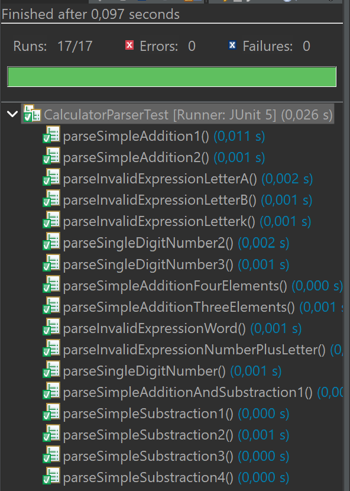

### Ejemplo 18

**INPUT y OUTPUT**: "9 - 5 + 4" -> 8

**EJ18. Código de test**

```java
@Test
void parseSimpleAdditionAndSubstraction2() {
	assertEquals(8, calculatorParser.parse("9 - 5 + 4"));
}
```

**EJ18. Mensaje del test añadido que NO PASA**

```log
org.opentest4j.AssertionFailedError: expected: <8> but was: <0>
```

**EJ18. Código mínimo para que el test pase**

Describe brevemente el código mínimo implementado

```java
public int parse(String expression) {
	checkIfHasLetter(expression);
	if(expression.equals("7 + 1 - 5")) {
		return 3;
	}
	if(expression.equals("9 - 5 + 4")) {
		return 8;
	}
	if(expression.length() > 1) {
		String [] splittedExpression = expression.split(" ");
		int result = Integer.parseInt(splittedExpression[0]);
		if(splittedExpression[1].equals("-")) {
			for (int i=0; i<splittedExpression.length-1; i++) {
				result -= Integer.parseInt(splittedExpression[i+2]);
				i++;
			}
			return result;
		}
		for (int i=0; i<splittedExpression.length-1; i++) {
			result += Integer.parseInt(splittedExpression[i+2]);
			i++;
		}
		return result;
	}
	return Integer.parseInt(expression);
}
```

**EJ18. Captura de que TODOS los test PASAN**

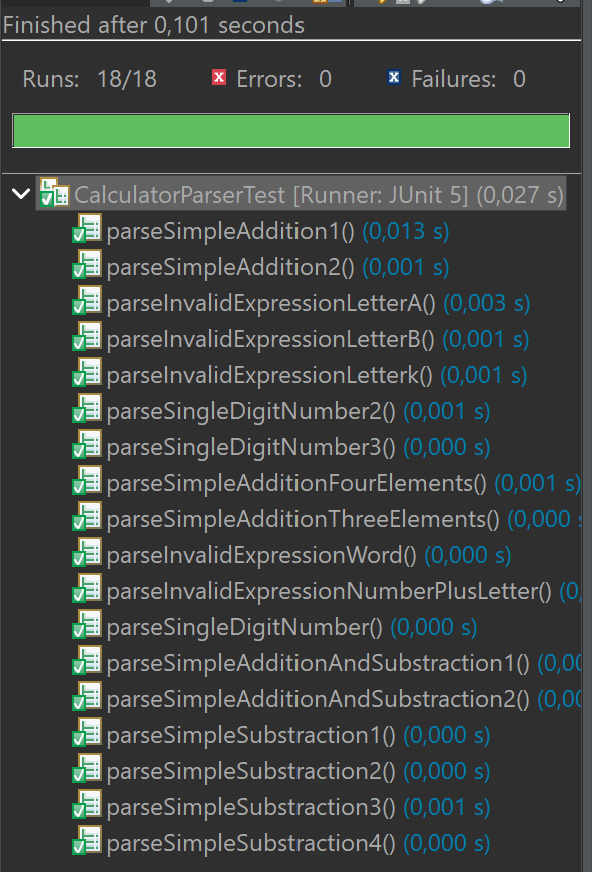

**EJ18. Refactorización**

Justificar vuestra refactorización aquí.

```java
public int parse(String expression) {
	checkIfHasLetter(expression);
	if(expression.length() > 1) {
		String [] splittedExpression = expression.split(" ");
		int result = Integer.parseInt(splittedExpression[0]);
		for (int i=0; i<splittedExpression.length-1; i++) {
			if(splittedExpression[i].equals("+")) {
				result += Integer.parseInt(splittedExpression[i+1]);
			}else if(splittedExpression[i].equals("-")) {
				result -= Integer.parseInt(splittedExpression[i+1]);
			}
		}
		return result;
	}
	return Integer.parseInt(expression);
}
```
**EJ18. Captura de que TODOS los tests PASAN tras la refactorización**

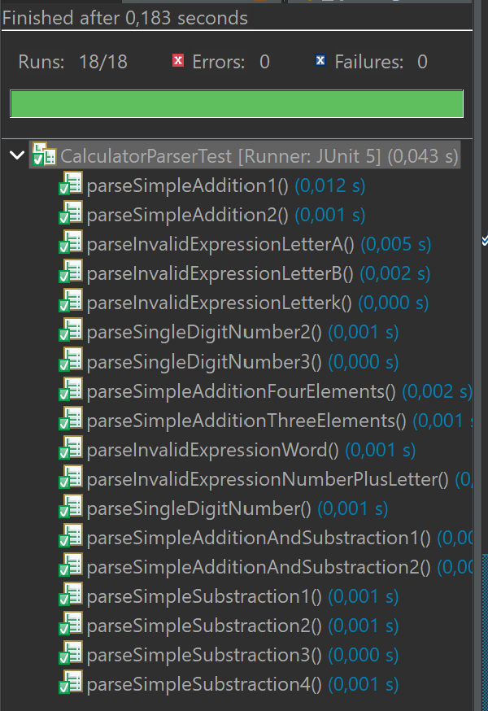

### Ejemplo 19

**INPUT y OUTPUT**: "9 + 1 - 6 - 2" -> 2

**EJ19. Código de test**

```java
@Test
void parseSimpleAdditionAndSubstraction2() {
	assertEquals(2, calculatorParser.parse("9 + 1 - 6 - 2"));
}
```

**EJ19. Código mínimo para que el test pase**

Describe brevemente el código mínimo implementado

**EJ19. Captura de que TODOS los test PASAN**

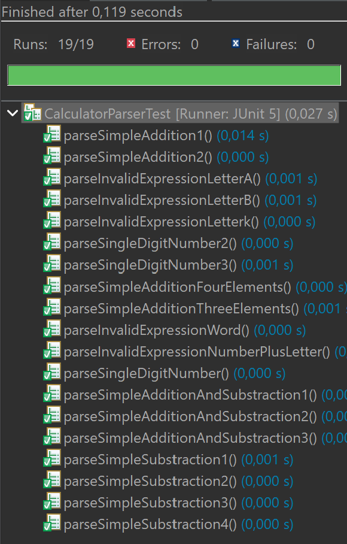

### Ejemplo 20

**INPUT y OUTPUT**: "-5 + 9" -> 4

**EJ20. Código de test**

```java
@Test
void parseSimpleAdditionAndSubstraction2() {
	assertEquals(4, calculatorParser.parse("-5 + 9"));
}
```

**EJ20. Código mínimo para que el test pase**

Describe brevemente el código mínimo implementado

**EJ20. Captura de que TODOS los test PASAN**

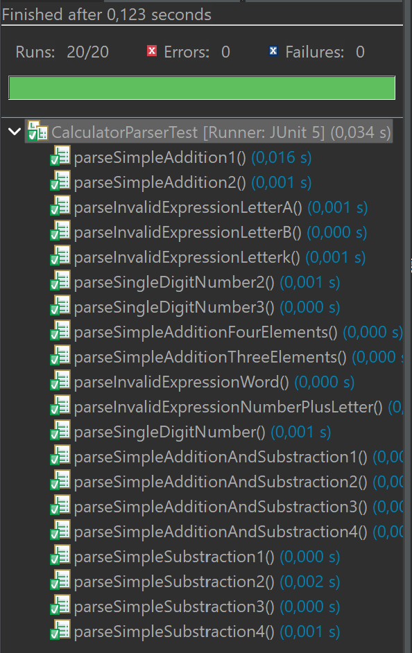
